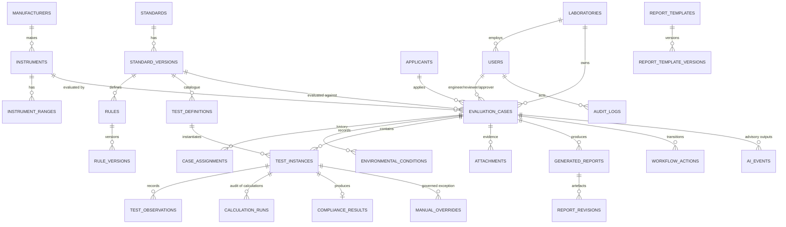

# MetrIQ Architecture

MetrIQ automates OIML R 76 type-evaluation test reports for non-automatic
weighing instruments. The governing principle is that **the compliance result
is produced only by a deterministic engine over versioned rule data**. AI is a
bounded, advisory layer that never decides compliance (PRD 12.5, 27.2).

## 1. System context

```
+----------------+        HTTPS         +---------------------------+
| Engineer /     | -------------------> | MetrIQ (FastAPI + static  |
| Reviewer /     | <------------------- | frontend, same origin)    |
| Approver /     |   JSON + PDF/DOCX    +-------------+-------------+
| Auditor /      |                                    |
| Lab Admin      |                                    |
+----------------+                         +----------+----------+
                                           |                     |
                                  +--------v--------+   +--------v---------+
                                  | PostgreSQL      |   | Object storage   |
                                  | (Supabase) or   |   | (Supabase bucket |
                                  | SQLite for demo |   | or local disk)   |
                                  +-----------------+   +------------------+
                                           |
                                  +--------v------------------+
                                  | AI provider (optional)    |
                                  | stub | OpenAI-compatible  |
                                  +---------------------------+
```

## 2. Containers

| Container | Technology | Responsibility |
| --- | --- | --- |
| Web UI | Vanilla ES modules served by FastAPI | Workflow, observation entry, "how calculated" panel, reports, admin |
| API | FastAPI 0.115 / Pydantic 2 | Auth, RBAC, case workflow, test engine, calculation, compliance, reporting |
| Database | PostgreSQL (Supabase) / SQLite | All structured records, rule data, audit trail |
| Storage | Supabase Storage / local disk | Evidence uploads and generated PDF/DOCX artefacts |
| AI provider | Stub (default) or OpenAI-compatible HTTP | Extraction, anomaly warnings, classification, R 76 assistant |

There is no build step. `backend/app/main.py` mounts `frontend/` at `/`, so the
UI and API share an origin and no CORS or token-in-URL workaround is needed for
normal use.

### Frontend conventions

The whole palette lives in `css/app.css` as custom properties: `:root` is the
dark control surface and `[data-theme="light"]` restates it, so no component
rule branches on the theme. `js/theme.js` owns the switch - the choice is kept
in `localStorage["metriq-theme"]`, the operating-system preference is the
default until the operator chooses, and a tiny inline bootstrap in each page
head sets `<html data-theme>` before the first paint so the theme never
flashes. Any element carrying `data-theme-toggle` becomes a switch, and the
shared topbar rendered by `ui.renderShell()` places one on every application
page.

`js/clock.js` repaints every `[data-clock]` element once a second and corrects
the browser clock by the offset it observes against `GET /health`'s
`server_time_utc`, so a workstation with a wrong system time still displays the
platform's date and time. Record timestamps are stored in UTC and rendered in
the operator's local timezone by `ui.fmtDate`.

## 3. Backend layout

```
backend/app/
  main.py            app factory, middleware, exception handlers, static mount
  config.py          pydantic-settings; every secret comes from the environment
  database.py        engine, session, JSON type (JSONB on PostgreSQL)
  models/            SQLAlchemy 2.0 declarative models
  schemas/           Pydantic request/response contracts
  routers/           HTTP surface (one module per domain)
  dependencies/      get_current_user, permission guards
  security/          passwords, JWT, permission catalogue, record scope, audit helpers
  rules/             rule expression evaluator + versioned rule JSON
  services/
    test_engine/       applicability -> test plan generation
    calculation_engine/ per-test deterministic calculators (decimal.Decimal)
    compliance_engine/ comparators (abs_lte, lte, gte, eq, range) -> PASS/FAIL
    report_engine/     snapshot -> PDF (reportlab) + DOCX (python-docx) -> hash
    ai_service/        provider abstraction: base + stub + openai
    audit_service/     append-only audit log, workflow log, notifications
    metrology_service/ orchestration: resolve MPE, evaluate a test, summarise a case
```

## 4. Authentication and authorization flow

```
Client --(POST /auth/login)--> password check (bcrypt) --> local JWT (HS256)
       <-- access_token (type=access) + refresh_token (type=refresh)
Client --(Authorization: Bearer <access>)--> API
                                          decode_token(expected_type="access")
                                          resolve_user_for_principal()
                                          require_permission(...) -> 403
                                          laboratory_filter() / case_visible() -> scope
```

* `AUTH_PROVIDER=hybrid` accepts both Supabase-issued JWTs and locally issued
  demo JWTs. `supabase` verifies JWTs against JWKS; `local` issues them.
* Access and refresh tokens carry a `type` claim so a refresh token can never be
  used as an access token and vice versa.
* Authorization is enforced in three layers: role permission check, laboratory
  scope, and record scope (engineer may only edit cases assigned to them).
* Permission catalogue: 34 codes across 6 roles (`routers/admin.py` exposes the
  matrix; `scripts/seed_identity.py` seeds it).

## 5. Data model

Key tables (35 total). Full ERD:



Design choices:

* **Versioned rules.** A case stores `standard_version_id`; rule data lives in
  `rules`/`rule_versions` and is loaded from JSON. Historical cases keep the
  version they were created with, so a later rule change cannot silently alter
  an old result.
* **Exact decimals.** Every numeric column is `Numeric`, and the engine computes
  with `decimal.Decimal` (28 significant digits). No float arithmetic touches a
  compliance decision.
* **Immutable results.** `calculation_runs` and `compliance_results` are
  append-only; a manual override writes a new `manual_overrides` row and leaves
  the automated result recoverable.
* **JSON columns** use `JSON` and are mapped to `JSONB` on PostgreSQL via
  `JSON().with_variant(JSONB, "postgresql")`.

## 6. Storage model

| Backend | Used when | Notes |
| --- | --- | --- |
| `local` | demo, tests | files under `STORAGE_LOCAL_PATH`; downloads go through `GET /attachments/{id}/download?token=...` with an HMAC-signed key and TTL |
| `supabase` | production | private bucket `STORAGE_BUCKET`; the API returns short-lived signed URLs |

Uploads are validated by extension, MIME type and size (`MAX_UPLOAD_BYTES`),
hashed with SHA-256 and recorded in `attachments`. Generated report artefacts
are written under `REPORT_STORAGE_PATH` and referenced by `report_revisions`.

## 7. Report-generation pipeline

```
case (approved) 
   -> build_report_snapshot()      frozen JSON: versions, cover, applicant,
                                   instrument, conditions, tests, results,
                                   rules, evidence index
   -> content_hash = sha256(canonical_json(snapshot minus volatile meta))
   -> verification_code = first 12 hex chars, upper-cased
   -> render_pdf / render_docx     deterministic renderers over the snapshot
   -> GeneratedReport + ReportRevision rows (sha256 of each artefact)
   -> finalize: is_immutable = true, locked_at/locked_by set
```

Finalization is **idempotent**: if an immutable report already exists for the
current case revision it is returned unchanged, so the hash and verification
code stay stable. Volatile metadata (`generated_at`) is excluded from the
content hash. A change to an approved case requires a new case revision, which
yields a new report revision.

## 8. AI service boundary

```
router -> get_ai_service(db, actor) -> AIProvider protocol
                                        |- StubProvider (default, offline)
                                        '- OpenAIProvider (HTTP, optional)
```

* The service always writes an `ai_events` row with provider, model, payload
  summary, confidence and (later) the human disposition.
* Every feature is individually toggleable via system settings; failures
  degrade to "AI unavailable" and never block calculation, workflow or
  reporting.
* Feature codes: `nameplate_ocr`, `anomaly_detection`,
  `document_classification`, `r76_assistant`.
* See `docs/ai/` for the full contract.

## 9. Request lifecycle

1. `request_context` middleware assigns `X-Request-ID` and times the request.
2. Authentication dependency resolves the principal (no DB hit beyond the user
   lookup) and rejects inactive users.
3. Permission guard runs before the handler body.
4. Record scope (`laboratory_filter`, `case_visible`, `case_editable_by`) is
   applied inside the handler.
5. Mutations write an `audit_logs` row (and a `workflow_actions` row for status
   transitions) in the same transaction.

## 10. Standards coverage and governance artefacts

| Artefact | Purpose |
| --- | --- |
| `docs/architecture/oiml-coverage-matrix.md` | Generated traceability matrix: clause -> test -> rule -> formula -> limit -> PASS/FAIL logic -> report section -> automated test. Regenerate with `python -m scripts.build_coverage_matrix` from `backend/`; `tests/test_coverage_matrix.py` fails if it drifts from the rule data. |
| `docs/architecture/ruleset-governance.md` | The ruleset lifecycle, the review records a metrology reviewer signs, and the activation gate. |
| `docs/architecture/report-mapping.md` | How clause-to-report mapping is validated, and the golden report fixtures that pin the rendered output. |

A test that the engine cannot execute is listed in the catalogue, the matrix and
the test plan with its implementation status and the reason, rather than being
hidden.
